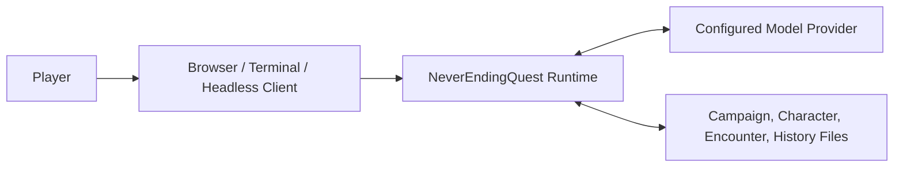
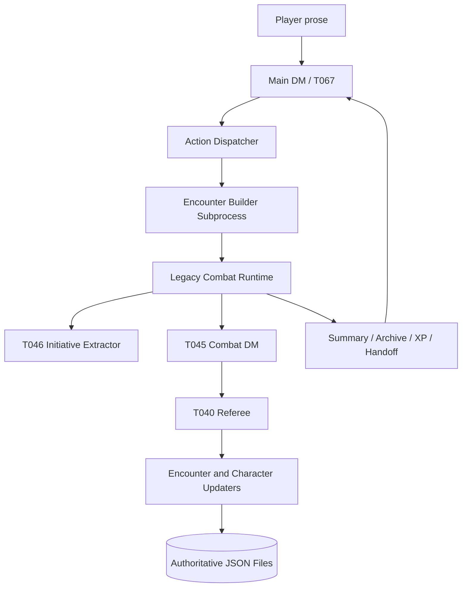
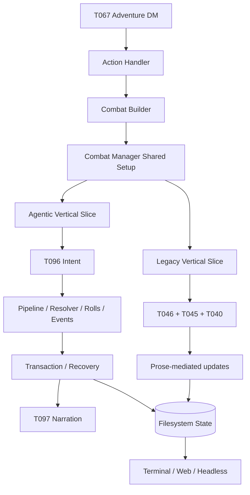
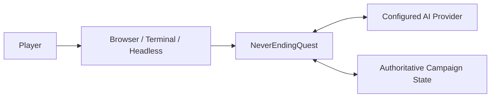
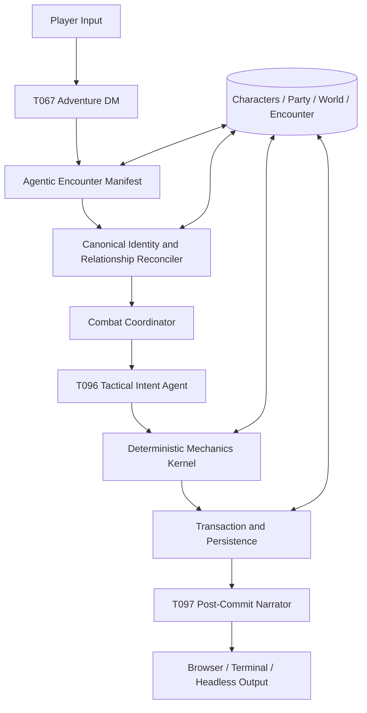

# Combat System Recovery Master Record

**Status:** Canonical scope and architecture record for review. No implementation is authorized by this document.

**Recorded:** 2026-08-22

**Authoritative repository:** `MoonlightByte/NeverEndingQuest`

**Pinned current main:** `691b5a2f06b472e31c7a123964844d9506862535`

**Clean historical main baseline:** `682103196420687f9cfd3e86dfd2edebe24e5964` (2025-08-22)

**Last live-proven pre-agentic main checkpoint:** `1c9fdc5cc6ea6460f7fb3d918c93a15a77c636d1`

## 1. Purpose and governing decision

This document records the complete mainline-only assessment of NeverEndingQuest combat after native-Windows browser acceptance exposed combat-integrity, recovery, narration, identity, and provider-liveness defects. It exists to prevent another narrow patch cycle from obscuring the architectural cause or discarding valuable work.

The governing conclusion is:

> Preserve the elegant original player experience and preserve the new deterministic, transactional, and recovery machinery. Repair the upstream semantic boundary between them. The model must establish structured scene facts and tactical intent; code must reconcile those facts against canonical state and own mechanics, ordering, arithmetic, persistence, and recovery. Do not infer scenario allegiance from `type`, prose, names, keyword lists, or regexes.

The current agentic pipeline must not be made mandatory unchanged. It remains contained until the participant/relationship contract is repaired and the full real-headless acceptance matrix passes. This is not a decision to abandon agentic combat or roll back the deterministic substrate.

## 2. Evidence rules

Every claim in this record uses one of these classes:

- **RUNTIME-OBSERVED:** Reproduced through the real native-Windows browser/headless game flow and judged through authoritative runtime state or on-disk files.
- **CODE-PROVEN:** Demonstrated by complete current or historical mainline functions, callers, schemas, prompts, diffs, and data flow.
- **HISTORY-PROVEN:** Demonstrated by Git ancestry and mainline commits.
- **HYPOTHESIS:** A plausible mechanism or proposed architecture that still requires real acceptance.

Cheap or synthetic evidence must not be presented as real gameplay acceptance. No monkeypatch or model-free unit probe proves a live combat seam. Narration is not authoritative evidence of state correctness.

## 3. Lineage boundary and contamination correction

Only ancestors of pinned `origin/main` may define shipped behavior or a compatibility baseline.

### Included mainline authority

- `68210319`: clean main snapshot from 2025-08-22.
- `1c9fdc5c`: live-proven fresh-game pre-agentic checkpoint. Its commit record documents a two-round Twig Blight combat, XP award, and clean return to the main loop.
- `27a25ce2`: mainline agentic combat rewrite.
- `06c93ed6`: event identity and effect-duration hardening.
- `eb2ecd52`: contextual SRD, narration dossier, delivery/recovery, and effect-clock expansion.
- `6ac9ea44`: character leases and stale-state protection.
- `0314322a`: explicit bounded legacy referee verdict.
- `aa2f84d2`: code-owned legacy round advancement.
- Current main through `691b5a2f`.

### Explicitly excluded as non-authoritative

The following are not ancestors of current main and are not design authority:

- `832aac22`, the unmerged always-agentic rollout switch removal.
- `be3f1943`, the separate guidelines branch.
- `6103fab3`, `73a8e457`, and the `pr117` lineage.
- Unmerged recruitment/NPC-voice branches such as `25b1913f` and `c5560742`.
- Ignored local C4 documents, abandoned plans, local transcripts, or debug artifacts.

Those artifacts may be archaeology but cannot define required behavior. Earlier analysis that treated the `pr117` family as an approved baseline is withdrawn.

### Required new safeguard

> A historical compatibility baseline must be an ancestor of the pinned `origin/main` revision or an explicitly owner-approved shipped release. Non-ancestral branches, worktrees, PR experiments, and local design documents are archaeology only and must never define required behavior.

This rule must be added to the repository's single-source agent guidelines before implementation resumes.

## 4. Recovered legacy behavioral contract

The historical contract below is recovered from `68210319` and the live-proven pre-agentic checkpoint `1c9fdc5c`.

### 4.1 Adventure-to-combat handoff

- The main DM semantically decides when awareness plus hostility crosses the Combat Commitment Point.
- It emits one `createEncounter` action and stops narratively resolving formal combat.
- The action contract is limited to `player`, `npcs`, `monsters`, and `encounterSummary`.
- Historical combat summaries are explicitly exempt from creating duplicate encounters or rewards.
- `process_ai_response` routes the action through `action_handler`.
- `action_handler` starts `combat_builder.py`, receives the encounter ID, writes `worldConditions.activeCombatEncounter`, reloads the location, and enters the dedicated combat loop.

### 4.2 Encounter construction and persistence

- The builder creates `<location>-E<n>` encounters.
- It loads or creates player, NPC, and monster profiles.
- It assigns d20 initiative and writes `modules/encounters/encounter_<id>.json`.
- The durable roster contains creature identity, display name, `type`, initiative, status, conditions, current/max HP, and action fields.
- Monsters are materialized as `type: enemy`; canonical NPCs are materialized as `type: npc`; the player is `type: player`.
- The original representation already conflated source category with broad combat role. This is a legacy limitation, not something invented by the agentic rewrite.

### 4.3 Player-facing combat experience that must be preserved

- Combat is a dedicated conversational subsystem with a separate history.
- It opens with a proper scene rather than a sterile mechanics screen.
- It provides initiative, creature state, armor class, and exact prepared rolls.
- Players roll their own attacks, damage, checks, and saving throws.
- NPCs and monsters consume exact state-provided rolls.
- The system stops exactly at the player's initiative turn.
- Consecutive non-player turns are resolved together in initiative order as one cinematic exchange.
- A submitted player action can close the remaining actor window for the round without repeated "keep going" prompts.
- Player reactions and saving throws produce deliberate pauses.
- Out-of-turn player intent is acknowledged and deferred rather than discarded.
- Narration is second-person, tactically grounded, and ends with a meaningful prompt only when the player owns control.
- NPC companions retain personality, role, dialogue, tactics, abilities, spells, damage, resources, and XP participation.
- Quick Roll buttons display dice; they do not submit player input. The player must type the roll result.

### 4.4 Legacy semantic and reconciliation seam

The old system already contained a partial version of the intended architecture:

- T046 semantically extracted initiative/acted-state facts from recent prose.
- Code reconciled identities, statuses, ordering, round, and actor-window shape against the real encounter.
- Invalid extraction fell back to a deterministic state-derived tracker.
- T045 authored narration and structured actions.
- T040 independently refereed the candidate against encounter state and conversation.
- Rejected candidates were excluded from canonical history and could not mutate state.
- Code enforced identity consolidation, one encounter update, processing order, XP division, history ordering, and cleanup.

This pattern - agent extracts meaning, code reconciles against state - is the strongest legacy architectural seam to preserve and expand.

### 4.5 Recruitment and companions

- Recruitment was a semantic DM decision based on personality, relationship, obligations, and current circumstances.
- An NPC could agree, refuse, or offer conditional help.
- On agreement, `updatePartyNPCs` persisted canonical party membership.
- The combat DM used companion profiles, roles, attacks, features, spells, dialogue, and prerolls.
- There was no deterministic consent or eligibility engine.

The legacy path did not provide a proper canonical monster-companion model or typed in-combat relationship transition. That remains an owner-design decision, not permission to infer recruitment from type or prose.

### 4.6 Save, resume, completion, and handoff

- `activeCombatEncounter` is the restart authority.
- Startup detects it and resumes the real encounter.
- Combat history is reused only when its encounter marker matches.
- Resume narration is constrained to a same-round, no-mechanics exchange.
- Normal victory completion calculated XP, updated allied participants, summarized the fight, recorded the location event, archived the transcript, moved the active encounter to `lastCompletedEncounter`, and returned a historical summary to the main DM.
- Archive-before-clear kept incomplete exits restartable.
- The main DM produced a natural post-combat continuation.
- Save snapshots included party tracker, encounter files, characters, histories, location, and module state.

## 5. Proven legacy weaknesses

The original feel is a compatibility baseline; the entire old implementation is not.

- Mechanical arithmetic and resource changes were model-authored through prose.
- Update agents reinterpreted prose into absolute JSON mutations.
- Enemy and allied writes were separate and non-atomic.
- Narration could be shown before persistence finished.
- Round arithmetic was partially model-owned and accepted jumps greater than one.
- `sync_active_encounter` contained an inverted player-data branch, preventing valid player synchronization.
- `check_all_monsters_defeated` read `combatants` while the schema stored `creatures`, making its normal auto-exit check ineffective.
- Player HP/XP presentation could temporarily use stale startup data while later prompt context used refreshed files.
- XP could be applied before transcript archival; an archival failure preserved the active encounter and could make exit reward replay non-idempotent.
- Builder success was parsed from human stdout rather than a structured subprocess result.
- The very large legacy prompt contained internally competing turn/pause instructions.
- Mainline legacy combat was single-PC. Aborted multi-PC branches do not change that contract.
- The source contract `npcs[]` versus `monsters[]` could not explicitly represent hostile canonical NPCs, allied monsters, neutrals, or multiple sides.

## 6. Current mainline combat architecture

Current `run_combat_simulation` retains a large shared/legacy setup and two authority paths inside one monolith.

### 6.1 Shared entry and setup

1. T067 emits `createEncounter` with only `player`, `npcs`, `monsters`, and `encounterSummary`.
2. `action_handler` runs the builder and enters combat synchronously.
3. The builder hardcodes player/NPC/enemy types.
4. It stamps the configured pipeline mode into the encounter.
5. Unstamped historical encounters remain legacy.
6. The template default on authoritative main remains legacy; agentic mode is opt-in.
7. Shared setup loads legacy prompt/history, character records, encounter state, prerolls, opening/resume model calls, and presentation context.
8. Only inside the turn loop does current code choose the agentic or legacy vertical slice.

### 6.2 Legacy slice still on main

- T046 initiative extraction.
- T045 combat author and prose action generation.
- T040 semantic referee.
- Prose-mediated encounter and character updates.
- Model-authored exit with later deterministic hardening.

### 6.3 Agentic slice on main

- `combat_state` owns durable combatant IDs, initiative, cursor, acted set, revision, pending turn, pending delivery, replay ledgers, round, completion receipts, and recovery state.
- The transaction persists a turn claim before the model call.
- T096 receives authoritative state, exact required actor IDs, player input, capabilities, and SRD references.
- The model proposes structured tactical intent.
- Code validates exact actor order and resolves actors sequentially.
- Earlier events update the preview used by later actors.
- Code owns dice, HP, saving throws, resources, effects, event identities, and mechanical invariants.
- Events are staged before mechanical writes.
- Character writes occur before the encounter receipt/cursor commit. The design is crash-convergent but not a single atomic multi-file transaction.
- T097 narrates only after mechanics commit.
- Narration coverage is checked against stable committed event IDs.
- Exhausted narration retries use a deterministic committed-fact renderer.
- Stable delivery IDs permit reconnect replay without rerunning mechanics or narration.
- Agentic completion applies effect-clock exit, idempotent rewards, area summary, transcript archive, active-pointer cleanup, and completion closure.

### 6.4 Valuable work to retain

- Canonical combatant IDs and deterministic initiative tie-breaking.
- Exact actor windows, revisions, pending-turn claims, and replay ledgers.
- Structured intents and stable typed events.
- Sequential preview resolution.
- Code-owned dice, HP, resources, effects, saves, conservation, ordering, and completion receipts.
- Leases and state fingerprints protecting concurrent character updates.
- Crash-convergent replay and recovery.
- Separation of tactical intent from post-commit narration.
- Event-ID narration coverage and deterministic fallback.
- Stable reconnect delivery.
- Idempotent reward, summary, archive, and completion steps.
- Persisted per-encounter mode for historical compatibility.

## 7. Root architectural mismatch

The deterministic engine began one seam too late.

The current T067 action cannot express:

- canonical participant reference;
- source kind versus gameplay role;
- physical presence;
- player or DM control;
- side membership;
- pairwise ally/hostile/neutral relationships;
- temporary versus permanent alliance;
- objectives or non-annihilation completion;
- surrender, escape, betrayal, reinforcement, or recruitment transitions.

The builder therefore uses object shape as semantic truth:

- `monsters[]` becomes `type: enemy`.
- `npcs[]` becomes `type: npc`.
- Agentic state defaults `enemy` to hostile.
- Everything else defaults to party.
- Strict non-player targeting uses faction difference.
- Victory depends on the mechanically inferred hostile set.
- XP, persistence destination, UI overlays, unconscious/death handling, and completion also reinterpret type/faction.

The legacy representation was already incomplete. The agentic rewrite converted that latent convention into hard mechanical authority.

### 7.1 Code-proven hostile named-NPC failure

For an existing named NPC such as Farmer Willem:

1. T067 can preserve canonical NPC loading only by placing Willem in `npcs[]`.
2. The builder stamps `type: npc`.
3. State defaults Willem to `faction: party`.
4. Strict DM-controlled attacks cannot target same-faction actors.
5. An adjudicated player action can still damage Willem.
6. After Willem is defeated, the hostile list remains empty.
7. Victory requires at least one hostile and all hostiles resolved, so victory remains false.
8. The living player keeps party defeat false.
9. Player-control recovery also remains false.
10. The encounter cannot reach a correct completion state.

Putting Willem in `monsters[]` makes completion possible but loses the canonical NPC identity and routes him through monster loading/generation. This is not an acceptable workaround.

This chain is **CODE-PROVEN** against current main. The exact named-NPC scenario has not yet been reproduced through real headless acceptance on the pinned SHA.

### 7.2 Why more conditions are the wrong fix

Do not add scenario patches such as:

- `if type == npc and hostile-looking...`;
- name or filename guesses;
- verb lists;
- keyword/substring/regex checks over narration, descriptions, or reasons;
- `different faction == enemy` assumptions;
- special-case Farmer Willem or any named scenario;
- silent fuzzy creation when a referenced canonical entity is absent.

Those approaches encode an expanding list of scenarios rather than the model-authored structured fact that code actually needs.

## 8. Additional current-main concerns found during the audit

### 8.1 Prose-semantics violations

Current agentic combat includes regex or name-shape decisions that answer semantic questions:

- inferring requested dice from model-authored prompts;
- inferring saving-throw ownership from prompt prose;
- matching dice/spell wording to decide whether a player request is legal;
- matching prior DM/player prose to reject roll families/results;
- matching effect names or suffixes to impose mechanical durations;
- narration acceptance checks based on phrases, titles, numbers, or adjectives;
- NPC identity resolution through word-overlap fuzzy matching.

These mechanisms may have been added to contain observed failures, but they violate the agentic-first boundary and will grow another scenario list.

### 8.2 Code-authored tactical choices

- If a later automatic actor's target becomes stale, code may retarget to the sole opponent or convert the action to defend.
- Exhausted T096 retries can become a code-authored defend batch.

These are mechanically safe but tactically semantic. The agent should choose a valid alternative from refreshed state; code should only validate and reconcile it.

### 8.3 Duplicate vertical slices and complexity

Current main retains:

- two actor-window implementations;
- two mechanics/state-update engines;
- two round authorities;
- two narration flows;
- two completion protocols;
- two recovery/persistence models;
- shared legacy T043/T044/history setup for agentic sessions;
- type/faction semantics duplicated across builder, state, resolver, pipeline, manager, XP, narration, and UI.

The goal is not a blind deletion. The target design must first preserve the full legacy UX contract and prove the new path before the old path is retired.

### 8.4 Schema and consumer gaps

- The encounter schema has no authoritative participant manifest, relation graph, objective, or completion contract.
- Some pending structures remain broadly typed.
- XP divides against party-tracker members but agentic reward writes can include loaded non-party NPC records, producing a recipient/divisor mismatch.
- The UI overlays player HP from a sheet while NPC HP remains encounter-derived.
- No mainline combat operation currently represents reinforcement, roster mutation, relationship transition, or typed recruitment.

### 8.5 Confirmed unused/redundant seams

The audit found mainline definitions with no callers, including:

- `combat_agent.select_spell_references`;
- `combat_orchestrator._deterministic_narration`;
- `combat_manager.merge_updates`;
- deprecated `combat_manager.update_json_schema`;
- `combat_manager.create_consolidation_prompt`.

No removal is authorized until complete consumer and legacy-behavior review confirms they are genuinely dead in the implementation branch.

## 9. Consolidated issue ledger

The umbrella issue associated with this document coordinates the following existing issues. Their individual runtime evidence remains authoritative and they must not be closed merely because they are linked here.

### Core combat scope

- **#185 - P1 turn-window integrity. RUNTIME-OBSERVED.** The accepted legacy response replayed already-acted enemies, ignored the player's Second Wind and attack, killed the PC, and assigned death-save failures. Missing Quick Roll input should have caused a specific roll request, never actor replay. The issue's proposed deterministic guard is directionally correct for the legacy path, but final implementation must preserve the recovered actor-window contract and avoid prose parsing.
- **#184 - Medium defeat/recovery UX. RUNTIME-OBSERVED and corrected.** Terminal defeat asks the dead player for another command. Manual Load works and there is no hard recovery brick. Required behavior is a non-victory "Party defeated - Load or Reset" state, with processing/leases released, encounter preserved, no auto-load, no XP, and no completed-victory finalizer.
- **#188 - Medium combat/effects AC corruption. RUNTIME-OBSERVED; root mechanism not yet runtime-proven.** Validation transiently invented Defense style for a Protection fighter and changed AC 18 to 19 before later correction. AC must derive deterministically from actual canonical features and commit atomically.
- **#189 - Medium narration identity. RUNTIME-OBSERVED.** The sole player character was repeatedly narrated in third person as an NPC. The player identity and second-person contract must be explicit in model context; do not post-process prose with string replacement.
- **Hostile canonical NPC completion defect. CODE-PROVEN, runtime acceptance pending.** Current structured state cannot separately express NPC source identity and hostile relationship.

### Shared identity concern

- **#190 - Medium canonical identity round-trip. RUNTIME-OBSERVED; exact shared root remains suspected.** `Rowan Vale` became `rowan_vale` and was rejected against the display name for five paid attempts with no mutation. Combat participant reconciliation must use the same canonical identity boundary rather than display/slug/fuzzy comparisons.

### Adjacent but independently owned

- **#186 - High provider liveness. RUNTIME-OBSERVED.** A 600-second Gemma/LM Studio transport stall froze the single game thread. This is a cross-cutting provider/concurrency design problem, not the cause of the corrected #184 recovery state and not solved by the participant-manifest repair.
- **#187 - High travel data loss. RUNTIME-OBSERVED and code-confirmed.** Travel erased weather and political climate. It is outside combat architecture and should remain a separate fix with its own acceptance.

### Historical/related evidence to revisit during design

Issues including #66, #79, #81, #105, #108, #109, #123, #124, #146, #147, and #150 contain related encounter commitment, recovery, identity, turn validation, spell, narration/action, and actor-selection evidence. They must be reclassified against the new canonical architecture before reuse; old proposed fixes are not automatically valid.

## 10. C4 - recovered legacy system

### Level 1: system context



### Level 2: containers



### Level 3: legacy components

- Session/history matcher.
- Authoritative context assembler.
- Character/NPC/monster profile formatter.
- Preroll cache.
- Semantic initiative extractor.
- Structural initiative verifier and deterministic fallback.
- Deterministic actor-window builder.
- Combat prompt composer.
- Candidate generator.
- JSON/action-shape checks.
- Semantic referee and fail-closed history finalizer.
- Enemy encounter updater.
- Allied character-update consolidator.
- XP calculator.
- Combat summarizer and transcript archiver.
- Active/last-completed lifecycle manager.

## 11. C4 - current mainline system

### Level 2: current containers



### Level 3: current agentic components

```text
combat_builder
  -> type-derived roster and persisted mode
combat_state
  -> IDs, initiative, cursor, revision, pending state, completion state
combat_manager
  -> shared setup, mode branch, actor window, completion, delivery
combat_transaction
  -> claim, stage, apply, recovery, delivery receipt
combat_agent T096
  -> semantic tactical intent for required actors
combat pipeline/resolver/rolls/events
  -> deterministic mechanics and typed facts
combat_agent T097 + combat_narration
  -> committed-fact narration and fallback
filesystem/UI
  -> durable state, reconnect, presentation
```

## 12. C4 - required target architecture

### Level 1: system context



### Level 2: containers



### Level 3: component contracts

#### Agentic encounter manifest

The model reads the real player command plus current party, location occupants, canonical characters, monster sources, relationships, and world state. It returns structured facts only:

- canonical source reference and display identity;
- source kind, independent of allegiance;
- physical presence;
- controlling authority;
- side identifier;
- explicit pairwise relations where required;
- temporary encounter alliance versus persistent party membership;
- objectives and completion conditions;
- surrender, escape, reinforcement, betrayal, and recruitment proposals.

It must not decide arithmetic, file paths, IDs, mutation order, or whether a nonexistent record should be silently invented.

#### Identity and relationship reconciler

- Resolves every proposed participant against canonical current state.
- Assigns stable combatant IDs.
- Verifies physical presence, ownership, and existence.
- Refuses only genuinely absent/unowned facts and returns that refusal as narration, not a system error.
- Never rereads prose.
- Never uses fuzzy word overlap as final identity authority.
- Persists the reconciled manifest atomically with the encounter.

#### Combat coordinator

- Owns initiative cursor, round, actor windows, pause/resume, defeat/recovery, and completion orchestration.
- Preserves original initiative cadence and player-roll interaction.
- Serializes one authoritative turn transaction while allowing safe reconnect/recovery.

#### T096 tactical intent agent

- Receives exact eligible actor IDs and refreshed canonical state.
- Chooses tactics, dialogue, targets, spells, movement, surrender, and other semantic intent.
- If an intent becomes stale, the agent receives refreshed state and chooses again; code does not invent a tactical retarget or defend action.

#### Deterministic mechanics kernel

- Owns dice, legality, distances where represented, damage, healing, HP, death saves, resources, effects, durations, ordering, and conservation.
- Consumes structured intent and canonical state only.
- Produces stable typed events with before/after facts.
- Makes no decision based on prose wording.

#### Transaction and persistence

- Owns leases, revisions, state fingerprints, staged events, absolute replay, receipts, and crash convergence.
- Makes the commit point explicit.
- After the commit point, advisory work cannot turn a successful state transition into a reported failure.
- Recruitment/relationship transitions and party persistence must be exactly-once and consistent with encounter state.

#### T097 narrator

- Receives only committed structured facts plus personality/context.
- Describes the player in second person.
- Preserves NPC voice and cinematic pacing.
- Cannot introduce new mechanics or mutations.
- Deterministic fallback renders committed facts without changing them.

#### Completion resolver

- Evaluates structured objectives and relations, not `type`.
- Supports victory, defeat, surrender, escape, unresolved combat, multiple sides, neutral actors, and relationship changes.
- Applies rewards exactly once to canonically eligible recipients.

### Level 4: intended code ownership

```text
main.py / web/web_interface.py / core/headless/client.py
    interaction and delivery

core/ai/action_handler.py
    encounter routing; no allegiance inference

prompts/system_prompt*.txt and a typed manifest schema
    T067 scene semantics

core/generators/combat_builder.py
    reconciled materialization, not semantic classification

new or refactored encounter-manifest boundary
    identity, sourceKind, controller, sideId, relations, objectives

core/managers/combat_state.py
    initiative, cursor, revision, pending state, relations

core/ai/combat_agent.py
    T096 intent and T097 narration

core/combat/pipeline.py
core/combat/resolver.py
core/combat/rolls.py
core/combat/events.py
    deterministic mechanics

core/managers/combat_transaction.py
    durable commit, recovery, replay protection

core/managers/combat_manager.py
    reduced to coordination and compatibility routing
```

### Required data separation

At minimum, new encounters must separate:

```json
{
  "sourceKind": "character | monster | summon | hazard",
  "sourceRef": "canonical-reference",
  "controller": "player | dm_agent",
  "sideId": "stable-side-id",
  "relations": {"other-side-id": "ally | hostile | neutral"},
  "persistence": "character_sheet | encounter_only"
}
```

The final schema is owner-controlled. This example records the necessary separation, not final field names or consent to mutate frozen schemas.

## 13. What to retain, remove, and re-bound

### Retain

- All recovered legacy player-experience behaviors in Section 4.
- Stable IDs, deterministic initiative, actor windows, rolls, arithmetic, effects, resources, event facts, revisions, leases, recovery, and exactly-once receipts.
- T096 semantic tactics and T097 post-commit narration.
- Existing-save compatibility and per-encounter legacy stamping.
- Full canonical sheets and fresh on-disk state.

### Remove only after replacement is accepted

- `npcs[]`/`monsters[]` or `type` as side authority for new encounters.
- Faction defaults that make every NPC party and every monster hostile.
- "different faction means valid hostile target."
- Regex/keyword inference of dice, ownership, spell identity, duration, narration correctness, or identity.
- Code-authored tactical retarget/defend decisions.
- Duplicated legacy vertical slices, but only after real A/B proves the new path preserves their contract.

### Re-bound

- `type` becomes a compatibility/source adapter, not semantic allegiance.
- Recruitment becomes a typed semantic outcome reconciled against canonical identity and committed exactly once.
- Permanent monster companionship, multi-side persistence, and schema changes require explicit owner decisions.
- Legacy unstamped encounters remain legacy and are never silently rewritten mid-combat.

## 14. Implementation sequence and stop gates

No implementation should begin until this record is reviewed and accepted as the current design authority.

1. Add the lineage-authority safeguard to the single-source agent guidelines.
2. Owner-review and approve this master architecture and the unresolved schema decisions.
3. Pin an implementation branch to the then-current exact `origin/main` SHA.
4. Record the exact legacy behaviors and mainline consumers before editing.
5. Add real headless acceptance scenarios first.
6. Introduce the encounter-manifest seam without changing existing legacy encounters.
7. Reconcile canonical identities and relationships before persistence.
8. Migrate targeting, completion, XP, UI, recruitment, and persistence consumers together.
9. Preserve the deterministic agentic mechanics substrate.
10. Run the full adversarial native-Windows matrix on a real provider and real files.
11. Run a real A/B against the live-proven pre-agentic player experience where practical.
12. Independently review architecture, consumers/compatibility, and fail-forward behavior.
13. Only after acceptance, make new combat agentic by default and remove the hidden rollout switch in a separate reviewed commit.
14. Retire the legacy path only after existing-save and player-experience parity is proven.

Stop and return to design review if:

- a proposed fix adds a scenario-specific condition;
- a semantic decision is inferred from prose, type, name, or shape;
- a consumer is not mapped;
- an old working behavior changes outside explicit scope;
- acceptance requires monkeypatching;
- a non-main branch is cited as authority;
- narration is used as state evidence;
- a schema or player-visible contract is changed without owner approval.

## 15. Required real-headless acceptance matrix

Every scenario must use the unmodified `core/headless/client.py`, a pinned SHA, native Windows, a recorded provider/model, one isolated mutable game root, real player commands, and authoritative post-run file inspection.

| Scenario | Required proof |
|---|---|
| Standard party versus monsters, legacy/new A/B | Opening, initiative cadence, player-owned rolls, NPC voice, cinematic batching, save/resume, XP, archive, and main-DM handoff remain compatible |
| Missing Quick Roll input | Game requests the exact missing roll; no actor replay, skipped player action, or state mutation |
| Existing hostile canonical NPC | Canonical character identity remains intact; hostile relationship drives targeting/completion rather than NPC type |
| Friendly monster | Monster source remains allied and is never counted hostile merely from source kind |
| Neutral witness/creature | Presence persists without forced targeting or blocking completion |
| Three-sided party/cult/demon fight | Explicit relations permit non-player sides to oppose each other without a binary shortcut |
| Same species/name on opposing sides | Distinct canonical references and IDs; no display-name merge or retarget |
| Party NPC refuses involvement | Party persistence remains intact while encounter presence/control follows the agentic fact |
| Recruit hostile NPC during combat | Typed relation transition occurs once; encounter and party records remain consistent |
| Recruit monster | Temporary versus permanent membership is explicit; source kind remains monster; persistence follows owner-approved contract |
| Failed/nonexistent recruitment | Narrated refusal; zero guessed identity or mutation |
| Betrayal/surrender/charm expiration | Exactly one structured relation transition; no stale target legality or premature completion |
| Reinforcement | Canonical source verified; deterministic entry timing; no duplication after restart |
| Terminal party defeat | Clean "Load or Reset" recovery, encounter preserved, no victory finalizer, XP, or auto-load |
| AC/effect regression | Protection fighter remains at canonical AC; no transient invented Defense bonus on disk or in encounter state |
| Sole-player narration | Player addressed in second person over the full combat and post-combat handoff |
| Identity round trip | Display name, canonical ID, and file reference remain consistent without five-attempt no-op loops |
| Crash/restart matrix | Restart at manifest, encounter, pending intent, staged mechanics, relation/recruit, narration, reward, and archive boundaries yields no duplicate turn, recruit, mutation, or XP |
| Ambiguous/malformed model fact | Bounded correction or narrated refusal; no guessed identity and no mutation |
| Phrasing adversary | Diverse natural phrasings resolve to equivalent structured facts without keyword/regex gates |
| Legacy save | Unstamped legacy encounter loads and behaves unchanged; no automatic faction rewrite |
| Browser reconnect | Stable committed output replays without rerunning mechanics or narration |
| Provider stall during combat/build | Tracked separately under #186; no claim of combat semantic acceptance may hide a stalled provider |

## 16. Current runtime acceptance status

- The browser E2E on `691b5a2f` produced the runtime observations in #184-#190.
- The corrected manual-load probe proves #184 is not a hard recovery brick.
- Current ignored game state contains no active combat and no authoritative current agentic acceptance artifact.
- Existing local agentic transcripts cover ordinary party-versus-monster fights only. They do not prove hostile NPCs, allied monsters, neutrality, recruitment, or multiple sides.
- The hostile named-NPC completion mechanism is code-proven but not yet live-reproduced on the pinned SHA.
- No model call or runtime mutation was performed for this architecture audit.

## 17. Master safeguard audit

The repository guidelines already require agentic-first decisions, real-headless acceptance, inspection before claims, legacy preservation, full consumer mapping, evidence classification, and one-item-at-a-time work. Applied prospectively, those safeguards would have identified:

- no authoritative combat design document on main;
- no explicit source-kind/side/relation authority;
- code answering the semantic question "who is hostile?" from object shape;
- inadequate acceptance limited to ordinary party-versus-monster fights;
- missing consumer review across prompt, builder, schema, targeting, completion, UI, XP, recruitment, and old saves;
- non-main artifacts being mistakenly treated as design authority.

This document is therefore the restart gate: it must be reviewed before combat changes resume. It records scope; it does not authorize code.

## 18. Final decision statement

Do not roll combat wholesale back to the 2025 implementation. Do not enable the current agentic implementation unchanged. Do not repair scenarios through more backend conditions.

Recover the original combat experience, keep the deterministic and transactional improvements, and add the missing agentic encounter-manifest boundary so scenario identity, allegiance, control, objectives, recruitment, and relationships arrive as structured model-authored facts reconciled against real state. Only after the complete native-Windows headless matrix passes should the agentic path become mandatory and the compatibility path be retired.
